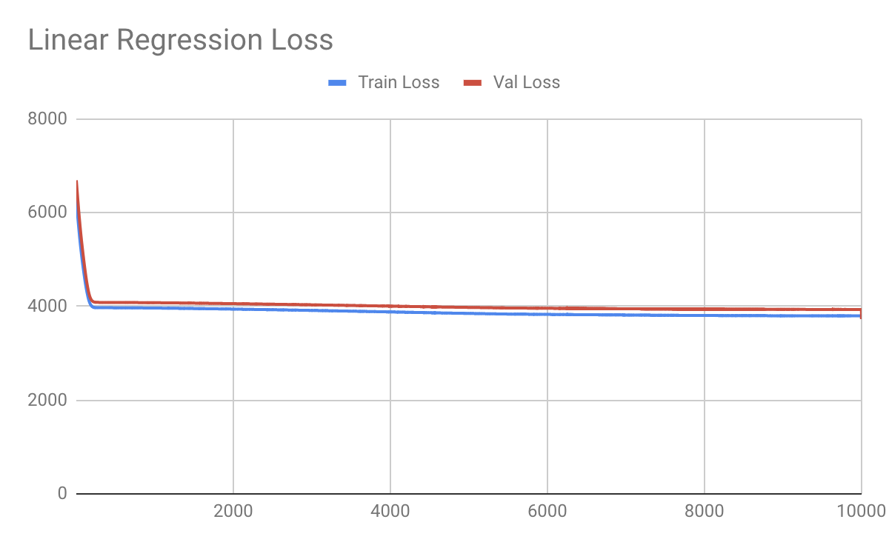
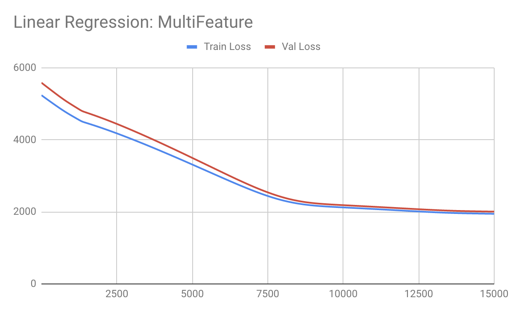
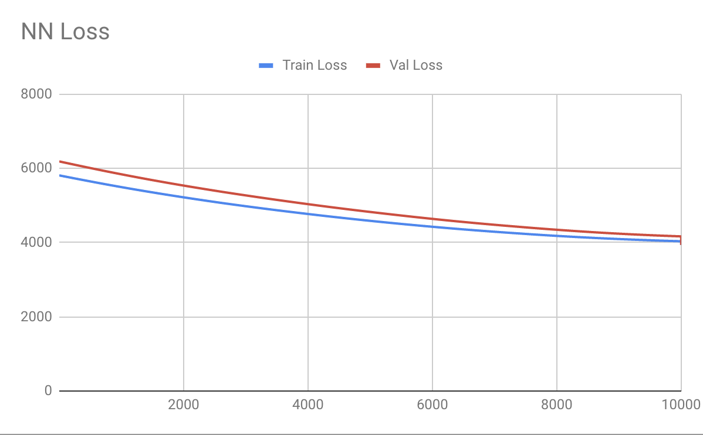
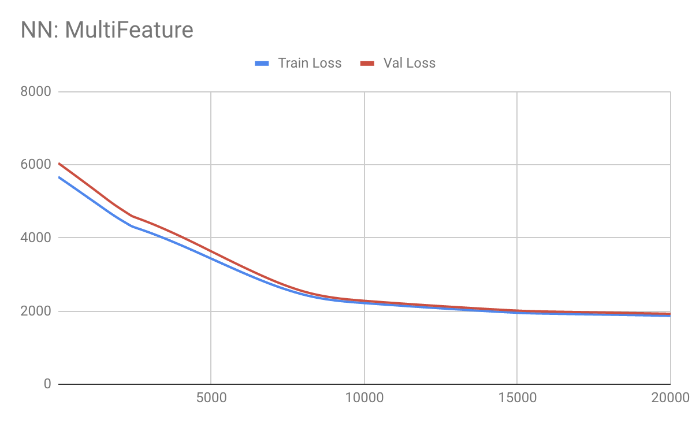

# Gaia

## Overview
Gaia is an AI-native platform that uses predictive modeling, NLP, and image recognition to automate and augment disaster claims processing.   
Gaia's models will automatically estimate reimbursement amounts per claim, based on customer-submitted pictures, text descriptions, and survey form entries.
Adjusters can refine model estimates based on outside knowledge/expertise. (Every human input improves model performance over time.)   
User Flow:
1. Open Gaia. Preloaded data reflects initial model outputs (estimated reimbursement amounts for each submitted claim).
2. View Heatmap to identify areas of interest. Heatmap shows highest number and value of open claims.
2. On map, zoom into area of interest (e.g., Tampa, Florida)
3. Middle panel will populate with open claims in that area.
4. Validate: Top part of middle panel shows highest-confidence estimates - user would spot check high-dollar claims to verify accuracy
5. Investigate: Bottom part of middle panel shows lower confidence estimates, which need additional human input.
6. Click on a specific claim to load it in the right-hand panel
7. Click on a feature's Severity to adjust it based on human knowledge/observation
8. Validation checkbox appears
9. Click on a claim's value (top of right-hand panel) to edit it.
10. Editing claim value retrains model (middle panel refreshes)

See the <b>[Models](#model_explanation)</b> section for a detailed explanation of the current AI model used and relevant decisions.

## Technologies
#### to install
* [python3.7](https://www.python.org/downloads/)
* [npm](https://docs.npmjs.com/downloading-and-installing-node-js-and-npm)
* [rabbitmq](https://www.rabbitmq.com/download.html)
* [postgres](http://postgresguide.com/setup/install.html)

#### to note
* PyTorch
* Pandas
* Numpy
* Flask
* Celery

## Setup
* Install DB: `initdb -D core_insure/data/psql`
* Install Python Reqs: `cd core_insure && pip3 install -r requirements.txt && cd ..`
* Install UI: `cd ui && npm install && cd ..`

## Run Main Service
* Start DB: `pg_ctl -D core_insure/data/psql -l logfile start`
* Start UI: `cd ui && npm start && cd ..`
* Start Server: `cd core_insure && python3 run_server.py && cd ..`
* Start queueing service & workers
  * `rabbitmq-server`
  * `celery -A server worker --loglevel=info`

## Analytics for models
* Start notebook: `jupyter notebook`
  * Navigate to: `model_analytics.ipynb`

## Notes
Due to lack of time, each individual component was prioritized for completion as the best possible proof of concept. Therefore, the backend and models work independently from the front-end. We thought proving the following would be most vital, so the following are the components completed:
* A server and a database access object that provides an API for the most useful components of the application
  * Given a list of attributes and an updated claim amount from the user, the model could be retrained on new data sent by the user in production. This model could then be used to update the values asynchronously in the database as well
  * Specific houses and attributes could be saved and updated via the database access object
  * Retrieving all relevant houses for a specific region, so that users can appropriately prioritize building selection
* A UI to demonstrate the user flow and concept outline
  * A heatmap to easily indentify and select most crucial areas
  * Easy-to-navigate interface for prioritizing individual buildings
  * A way to update features and provide additional training data to the model
* A basic ML model that can estimate claim amounts based on granular data and learn from additional user interactions to demonstrate viability of overall product for the business case

Components remaining:
* Postgres implementation of database access object
* Linking UI to hit the API

## Models

The AI problem we chose to tackle first as PoC is the prediction of claim amounts, since this provides the most value to the user with the least effort.   
Currently, we're using a two-layer feed forward neural network with a ReLu as the activation function. Instead of the standard MSE loss function for a regression, SmoothL1Loss was used to bound coefficients along with a smaller learning rate to mitigate the exploding gradient problem.   
This model was compared against a baseline linear regression model and seemed to perform slightly better due to the extra capabilities captured by the non-linearity.

The [dataset](https://www.fema.gov/openfema-dataset-individual-assistance-housing-registrants-large-disasters-v1) of housing assistance during large disaster from the FEMA site was used.
Two 70-20-10 train/test/val splits were made.The size of each set of 100,000; increasing the data size did not dramatically change model performance. The two sets consisted of:
1) The full dataset of both approved and rejected claims
2) A subset of only approved claims

This distinction was made, because it was found that such a large portion of the dataset included rejected claims, which taught the model to just predict values close to zero.  
Therefore, numbers will only be summarized below for Dataset 2 (Approved claims)

#### Results
The best model was the simple NN run on 8000 epochs. The train vs val loss curves were analyzed to help determine this cut-off point.
Given a low amount of features, the simple linear regression works the best, because it converges to approximately the same loss in a much shorter amount of time compared to the NN (~300 epochs vs ~8000)
However, since the value of our product is the aggregate of a huge feature set, it's important that our model scales well with our use case.
When the features were increase from 1 to 7, the linear regression model took much longer to converge at ~9000 epochs (30x the original). However, the NN converged at approximately at ~9000 (1.1x the original).

So we've chosen to move forward with

* Linear Regression:
  * Single Feature
    * Dataset 2 (Approved Claims):
      * Train vs Val Loss
      * 
      * Test Loss @ 300: 4084.12
  * Multi-Feature (7)
    * Dataset 2 (Approved Claims):
      * Train vs Val Loss
      * 
      * Test Loss @ 9000: 2287.42
* Simple NN
  * Single Feature
    * Dataset 2 (Approved Claims):
      * Train vs Val Loss
      * 
      * Test Loss @ 8000: 4176.87
  * Multi-Feature (7)
    * Dataset 2 (Approved):
      * Train vs Val Loss
      * 
      * Test Loss @ 9000: 2386.17

#### Improvements
One of the biggest flaws with this model is the lack of granular data. At the level of information publicly provided, it is almost impossible for a model to predict a truly accurate claim value.
For example, general information such as "water level" is given for a flood. This can help give a relative idea of damage. However, any key indicators regarding the size of the property impacted are not present.

This fault can be noted by the high loss even when training until convergence with large amounts of data as well as the fact that two different models had similar convergence loss values for each set of features. The clear decrease in minimum loss given an increased amount of features is a good indicator that adding more granular data will fix this issue.
Since we will be partnering with insurance companies on initial launch, this issue will be mitigated by the fact that we will have access to all the necessary granular details.  
There will also need to be a lot of work done around making the model production-ready, including hyper-parameter tuning, offline metrics verifications (e.g. k-folds cross validation) as well as A/B testing with a few model variants to catch metrics that could be much more easily represented with online metrics (e.g. a specific model correctly emphasizes a factor unoticed by other models that could be caught by capturing amount of times user updates claim amounts).